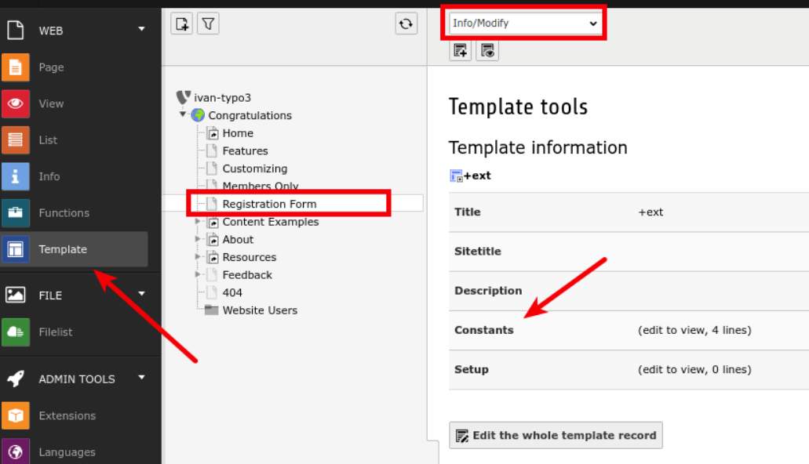

.. ==================================================
.. FOR YOUR INFORMATION
.. --------------------------------------------------
.. -*- coding: utf-8 -*- with BOM.

.. include:: ../Includes.txt

.. _administrator-manual:

Administrator manual
====================

CleverReach® extension supports frontend user registration added by these two extensions: ``sr_feuser_register`` and
``femanager``. If you have one of these, you can add "Subscribe to newsletter" option to frontend users.

Configuration for ``femanager`` extension
-----------------------------------------

This extension does not need additional configuration from administrator.

Configuration for ``sr_feuser_register`` extension
--------------------------------------------------

In order to add subscription status field, you need to edit a specific template file of ``sr_feuser_register``.
Open file ``Resources/Private/Templates/RegisterHtmlTemplate.html``, locate and edit the following sections:

- ###TEMPLATE_CREATE###
- ###TEMPLATE_CREATE_PREVIEW###
- ###TEMPLATE_INVITE###
- ###TEMPLATE_INVITE_PREVIEW###
- ###TEMPLATE_EDIT###
- ###TEMPLATE_EDIT_PREVIEW###

Note: If you want to edit email templates as well, you can do it by following the same procedure.

Take a look at how predefined extension fields are included in each of the subparts
and do the same for the fields you are adding. The HTML for a field named ``cr_newsletter_subscription``
in the **CREATE**, **INVITE** and **EDIT** subsections should look like this:

.. code-block:: html

    <!-- ###SUB_INCLUDED_FIELD_cr_newsletter_subscription### -->
    <dt>
        <label for="tx-srfeuserregister-pi1-cr_newsletter_subscription">###LABEL_CR_NEWSLETTER_SUBSCRIPTION###</label>
        ###REQUIRED_CR_NEWSLETTER_SUBSCRIPTION###
    </dt>
    <dd>
        <!-- ###SUB_ERROR_FIELD_cr_newsletter_subscription### -->
        
###EVAL_ERROR_FIELD_cr_newsletter_subscription###

        <!-- ###SUB_ERROR_FIELD_cr_newsletter_subscription### -->
        <!-- ###SUB_REQUIRED_FIELD_cr_newsletter_subscription### -->
        
###MISSING_CR_NEWSLETTER_SUBSCRIPTION###

        <!-- ###SUB_REQUIRED_FIELD_cr_newsletter_subscription### -->
        ###TCA_INPUT_cr_newsletter_subscription###
    </dd>
    <!-- ###SUB_INCLUDED_FIELD_cr_newsletter_subscription### -->

In each **PREVIEW** subsection, you need to add these lines:

.. code-block:: html

    <!-- ###SUB_INCLUDED_FIELD_CR_NEWSLETTER_SUBSCRIPTION### -->
    <dt>###LABEL_CR_NEWSLETTER_SUBSCRIPTION###</dt>
    <dd>###TCA_INPUT_cr_newsletter_subscription###</dd>
    <!-- ###SUB_INCLUDED_FIELD_CR_NEWSLETTER_SUBSCRIPTION### -->

Modify the TS template Constants
--------------------------------

Final step for adding newsletter subscription field to frontend is to edit TS.
Open Constants editor for your registration form:

In Constants editor you should see something like this:

.. code-block:: typoscript

    plugin.tx_srfeuserregister_pi1 {
        # cat=plugin.tx_srfeuserregister_pi1//; type=string; label= Registration form fields: List of fields to be included on the front end user registration form.
      formFields = <field_1>, <field_2>, <field_3>, … <field_n>
    }

where ``<field_1>, <field_2>, <field_3>, … <field_n>`` is a list of fields that should be rendered on the form.
At the end if the list (or anywhere you would like this field to be displayed) add ``, cr_newsletter_subscription``
so that final typoscript should look similar to this:

.. code-block:: typoscript

    plugin.tx_srfeuserregister_pi1 {
        # cat=plugin.tx_srfeuserregister_pi1//; type=string; label= Registration form fields: List of fields to be included on the front end user registration form.
      formFields = <field_1>, <field_2>, <field_3>, … <field_n>, cr_newsletter_subscription
    }

With this, you should be able to let users who register through frontend to choose whether they want to
subscribe to the newsletter.