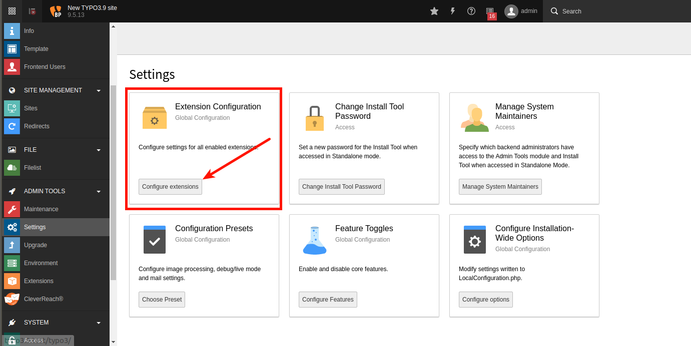

.. ==================================================
.. FOR YOUR INFORMATION
.. --------------------------------------------------
.. -*- coding: utf-8 -*- with BOM.

.. include:: ../Includes.txt

Installation
============

**Step 1:**  Go to the main menu and click on “Extensions” in the Admin Tools section.

**Step 2:** If you have a zip archive, upload it to Typo3.

If you don’t have a zip archive, you can get the extension directly from the Typo3 Extension manager.

Either you download or upload the extension, Typo3 will automatically install it.
The CleverReach® extension appears on the list of your installed extensions. You can access it via your main menu.

**Step 3:** To configure CleverReach® on TYPO3 v7.x or v8.x, go to the list of your installed extensions and click on the “Configure” icon.

To synchronize your existing frontend users as subscribers please check ‘syncUsersAsSubscribers’.

To configure CleverReach extension on TYPO3 v9.x, please click on the 'Settings' tab in the sidebar menu, under the “ADMIN TOOLS” section.

Choose 'Extension configuration'

From the extension list, click on the “official_cleverreach“.

To synchronize existing frontend users as subscribers please check “syncUsersAsSubscribers“ field.

