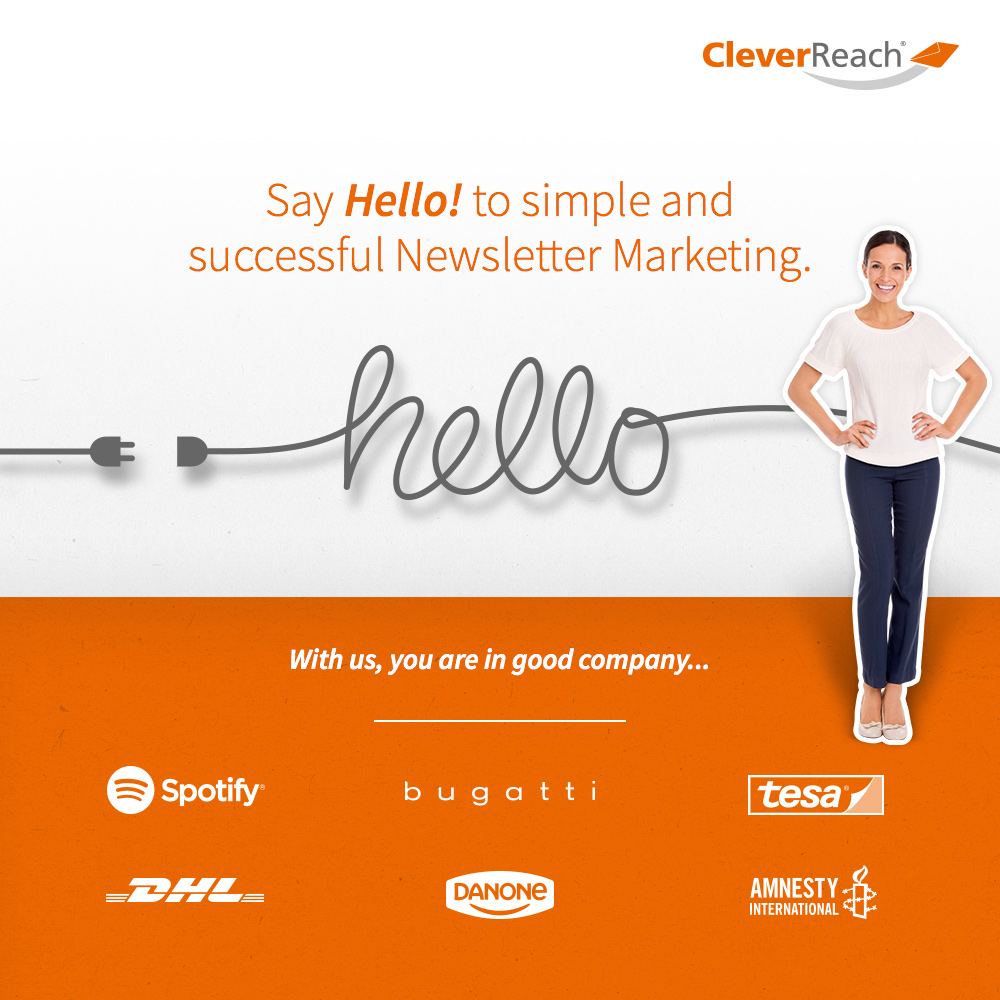

.. ==================================================
.. FOR YOUR INFORMATION
.. --------------------------------------------------
.. -*- coding: utf-8 -*- with BOM.

.. include:: ../Includes.txt

What does it do?
================

Bugatti, Doodle, DHL and Greenpeace create and send their newsletters with CleverReach®.
Why? Because it is easy, easier, the easiest! Increase customer retention with our clever
and effective software, with a pricing that is just as flexible as you.

.. image:: ../Images/Introduction/EN_06_typo3_thea.jpg
    :width: 150px

CleverReach®: Simply awesome email marketing
--------------------------------------------

The CleverReach® extension connects our professional newsletter software directly with the TYPO3 backend.
Following data will be synchronized with our extension automatically:

- Newsletter subscriptions and registrations
- All data saved at user registration: First and last name, gender, age, birthday, address, interests…
- Website content for easy integration of information in newsletters without manual effort

You avoid mistakes and save your time with our automatic synchronization. Our useful extension helps you to keep
your recipients informed about products, events, announcements and editorial content. With our legally compliant
registration forms, you are always on the safe side when generating new addresses.
You profit from more email openings, more clicks and less effort – even more so with our easy email automation THEA.
That is the key to your success: make fans out of your clients!

Our most important features
---------------------------

- Easily create and send email newsletter with our drag & drop editor
- Integrate current news and content from your website into your newsletter with one click
- Free email templates, ready to use. Or simply import your own templates from other platforms into CleverReach® with our Template Converter
- Analyse your success with our reportings and optimize your newsletters accordingly
- GDPR compliant, highest security standards, email marketing made in Germany
- Free email support and online seminars (live and on demand)
- The right tariff for everybody; customizable and changeable at any time, no contract term, rates for small and big recipient lists: prepaid for occasional senders, flat rate for regular senders or high volume for big enterprises

Lots of additional features: Blacklist check, create newsletters, user friendly drag & drop editor, HTML editor,
source code editor, newsletter templates for every occasion, email templates, A/B split tests, spam tests,
image processing, RSS feeds, dynamic content, import functions, segment lists of recipients,
Double-Opt-In (DOI) registration forms, automatic bounce management, automatic unsubscribe management,
send newsletters, personalized newsletter delivery, social media Integration, extensive reporting and tracking,
opening rates, click rates, unsubscribe rates, unsubscriptions, multi-level bounce management,
Google Analytics integration, conversion tracking, automated mailings, lifecycle email marketing,
THEA – the easy email marketing automation, autoresponder, follow up emails, GDPR compliance, whitelisting,
CSA: Certified Senders Alliance, design tests, newsletter client testing, SPF: Senders Policy Framework,
email authentication, SSL encoding, WordPress plugin, direct mailing, import of .csv files, responsive templates,
free software, Typo3 newsletters, import Excel files, forms, direct marketing and many more!

If you have further questions you can visit our `online help center`_ or send our support team an email – we
would love to help you out!

.. _online help center: https://support.cleverreach.de/hc/en-us

Use our exclusive partner discount!
-----------------------------------

Exclusively for TYPO3 users:
****************************
**New customers save 10% of their CleverReach® tariff for one whole year!**
Your discount will be deducted directly after registration. Download your CleverReach® extension now!

What customers will appreciate
------------------------------

Your customers
- wait expectantly for the newest models of your newest kitchen sinks
- rely on the event reminders of your city news
- are happy about attractive deals for their next vacation
- don’t want to miss out on your next fitness workshop

In the perfect world of CleverReach® and TYPO3, your customers look forward to your next newsletters,
because every single one of them is exactly to their taste. And when your customers are so satisfied that they
recommend you to others, you can be sure to have done everything right.

You are happy, the customer is happy, and we are happy, too!

About CleverReach®
------------------

CleverReach® is the cloud-based software for email marketing. More than 190,000 customers, like Spotify, Levi’s,
Red Bull, DHL and Amnesty International, in 152 countries successfully use the software. CleverReach® was founded
in 2007 in Germany and offers highest standards of data security.
